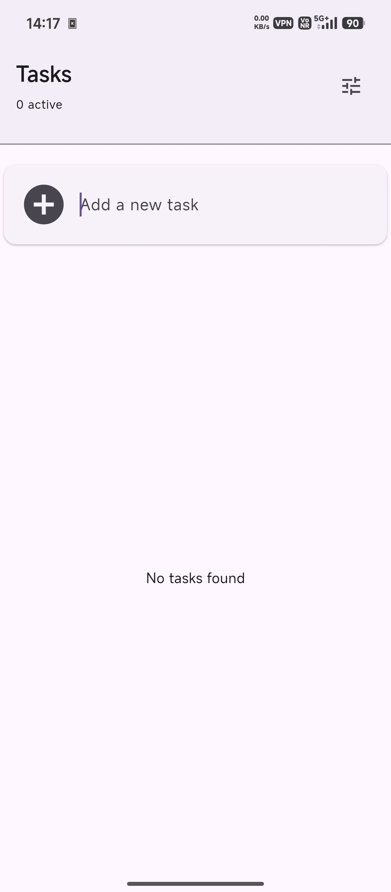
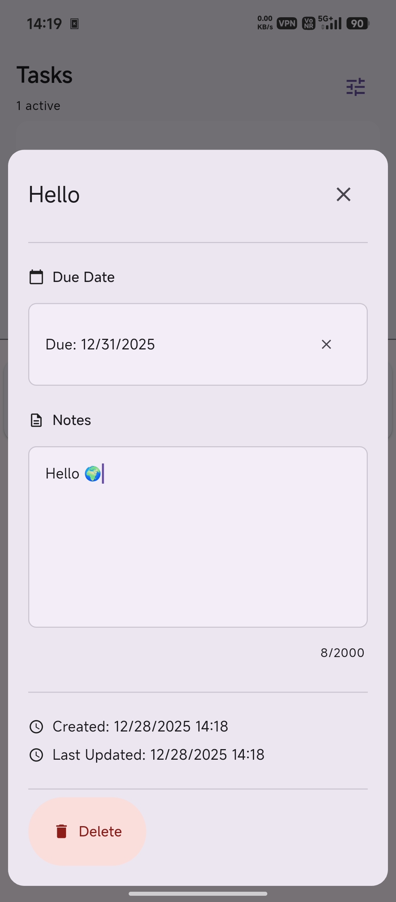
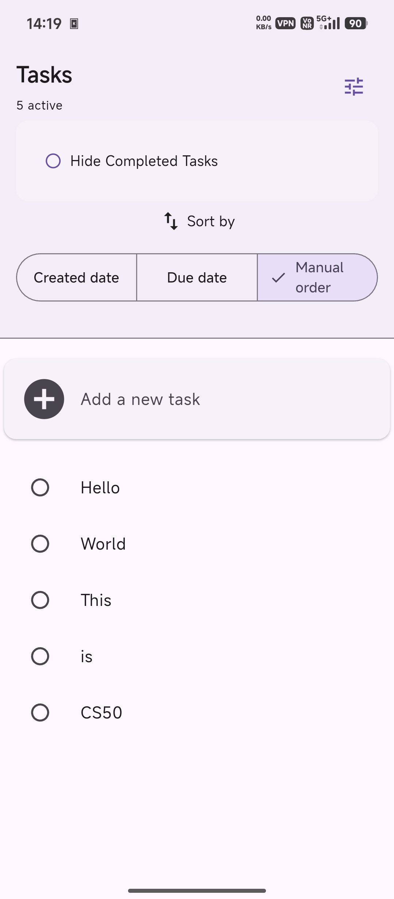
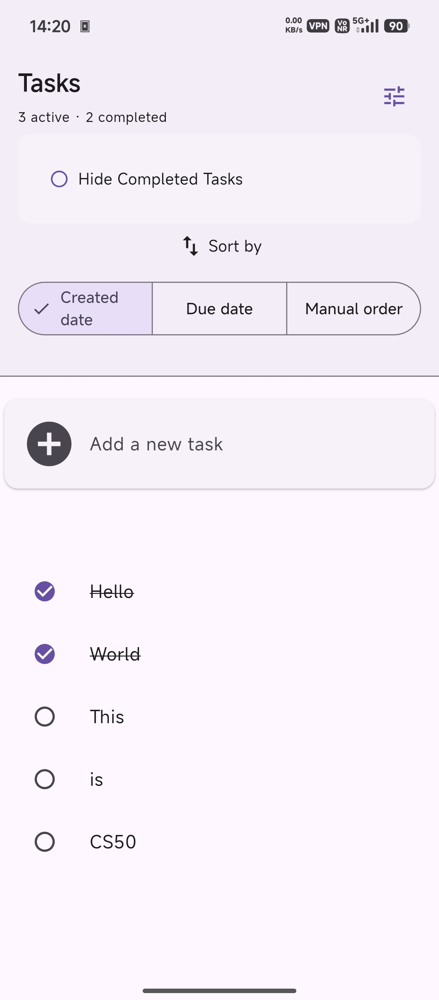

# Material Task Tracker

A local, Material Design–themed to-do application built with Flutter using Drift for persistence.

## 🚀 Features
- **Task details**: title, description, and due date
- **Task sorting**: by creation time, due date, or manual order
- **State persistence**: restore the last selected task filter on app restart
- **Task filtering**: hide completed tasks

## 📸 Screenshots

<p>
  
  
  
  
</p>


## ▶️ Getting Started
1. Install [Flutter](https://flutter.dev/docs/get-started/install).
2. Clone this repository:
   ```
   git clone https://github.com/architxkumar/material_task_tracker.git
   ```
3. Run the app:
   ```
   flutter run
   ```

## 📄 License
[MIT LICENSE](LICENSE)

